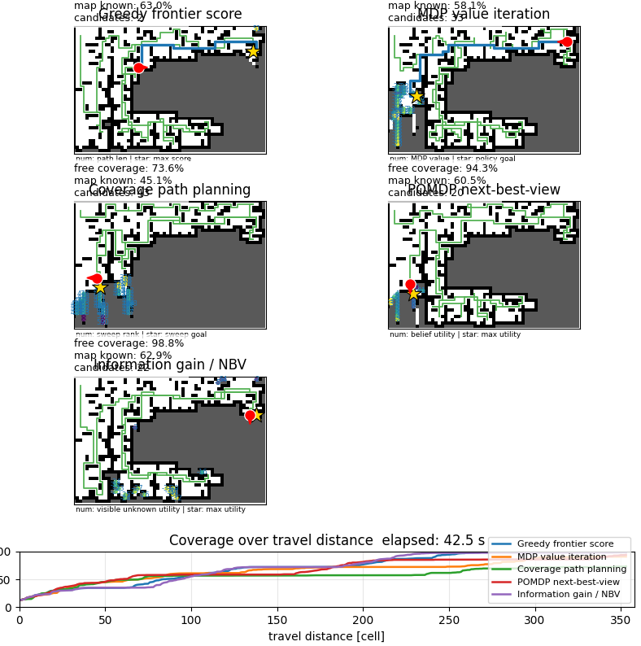

# CoverageDemo



This demo compares five coverage / exploration strategies on the same random grid map.

All methods use the same map state definition:

- `FREE = 0`: traversable cell
- `WALL = 1`: obstacle cell
- `UNKNOWN = -1`: unobserved cell
- `KNOWN_FREE = 0`: observed traversable cell
- `KNOWN_WALL = 1`: observed obstacle cell

The robot moves on known free cells only.  Candidate goals are frontier cells:

```text
F = {s | s is KNOWN_FREE and at least one 4-neighbor of s is UNKNOWN}
```

For a candidate cell `f in F`, let:

```text
d(s, f)  = shortest path length from robot state s to f on known free cells
u(f)     = number of UNKNOWN 4-neighbors around f
```

## 1. Greedy frontier score

File:

```text
python/cavarage.py
```

This method directly scores each frontier candidate and chooses the maximum-score candidate.

The implemented score is:

```text
J_greedy(f) = UNKNOWN_GAIN * u(f) - DIST_GAIN * d(s, f)
```

The selected goal is:

```text
f* = argmax_{f in F} J_greedy(f)
```

Characteristics:

- simple and fast
- prefers nearby frontiers with many adjacent unknown cells
- can be locally greedy in maze-like maps

## 2. MDP value iteration

File:

```text
python/cavarage_mdp.py
```

This method treats known free cells as MDP states and 4-neighbor moves as actions.

State and action:

```text
S = {s | s is KNOWN_FREE}
A = {up, down, left, right}
```

Transition is deterministic:

```text
T(s, a) = s'
```

where `s'` is the next known free cell.  Invalid actions keep the robot near the same state with penalty.

Frontier reward:

```text
R(f) = UNKNOWN_GAIN * u(f),  f in F
```

For non-frontier motion:

```text
R(s, a, s') = -MDP_STEP_COST
```

Value iteration:

```text
V_{k+1}(s) = max_a [ R(s, a, T(s,a)) + gamma * V_k(T(s,a)) ]
```

Frontier states are treated as terminal reward states:

```text
V(f) = R(f)
```

The policy is:

```text
pi(s) = argmax_a [ R(s, a, T(s,a)) + gamma * V(T(s,a)) ]
```

The robot follows `pi(s)` until it reaches a frontier candidate.

Characteristics:

- considers value propagated through the known free-space graph
- less purely local than greedy frontier selection
- depends on `MDP_GAMMA`, `MDP_STEP_COST`, and reward scaling

## 3. Coverage path planning

File:

```text
python/cavarage_cpp.py
```

This method uses a boustrophedon-like sweep order.  The map is divided into horizontal bands, and the preferred order alternates left-to-right and right-to-left.

Let:

```text
b(f) = floor(y_f / CPP_SWEEP_BAND_HEIGHT)
```

The sweep rank is:

```text
rank(f) =
  b(f) * W + x_f              if b(f) is even
  b(f) * W + (W - 1 - x_f)    if b(f) is odd
```

The implemented score is:

```text
J_cpp(f) =
    -rank(f)
    - CPP_DISTANCE_GAIN * d(s, f)
    + CPP_FRONTIER_GAIN * u(f)
```

The selected goal is:

```text
f* = argmax_{f in F} J_cpp(f)
```

Characteristics:

- tries to cover space in a structured sweep pattern
- can reduce random-looking movement
- less adaptive to irregular frontiers than information-driven methods

## 4. POMDP-like next-best-view

File:

```text
python/cavarage_pomdp.py
```

This is a lightweight approximate POMDP-style method.  Unknown cells are treated as belief states with a probability of being free:

```text
P(cell is free | UNKNOWN) = POMDP_UNKNOWN_FREE_PROB
P(cell blocks view | UNKNOWN) = 1 - POMDP_UNKNOWN_FREE_PROB
```

For each candidate `f`, virtual LiDAR rays are cast through the known / unknown map.  Along a ray, visibility probability decreases when passing unknown cells:

```text
p_0 = 1
p_{i+1} = p_i * POMDP_UNKNOWN_FREE_PROB
```

Expected observation gain:

```text
G_pomdp(f) = sum_{unknown cells c visible from f} p(c)
```

Expected occlusion risk:

```text
Risk(f) = sum_{unknown cells c visible from f} p(c) * POMDP_OCCLUSION_PROB
```

Implemented utility:

```text
J_pomdp(f) =
    G_pomdp(f)
    - POMDP_DISTANCE_GAIN * d(s, f)
    - POMDP_RISK_GAIN * Risk(f)
```

The selected goal is:

```text
f* = argmax_{f in F} J_pomdp(f)
```

Characteristics:

- explicitly models uncertainty and possible occlusion
- more conservative than pure information gain when unknown space may block view
- computationally heavier because it casts virtual sensor rays for candidates

## 5. Information gain / Next-best-view

File:

```text
python/cavarage_info_gain.py
```

This method evaluates how many unknown cells would be visible from each candidate, without using a probabilistic belief model.

Virtual LiDAR rays are cast from candidate `f`.  The visible unknown set is:

```text
U_visible(f) = {c | c is UNKNOWN and visible by ray casting from f}
```

Information gain:

```text
G_info(f) = |U_visible(f)|
```

Implemented utility:

```text
J_info(f) = G_info(f) - INFO_GAIN_DISTANCE_GAIN * d(s, f)
```

The selected goal is:

```text
f* = argmax_{f in F} J_info(f)
```

Characteristics:

- directly chooses viewpoints expected to reveal many unknown cells
- usually explores open areas efficiently
- does not model uncertainty or occlusion probability as explicitly as the POMDP-like method

## Comparison script

Run:

```bash
python3 python/cavarage_compare.py
```

The comparison script uses the same random terrain and initial pose for all methods.  It plots:

- robot position
- current goal
- planned path
- trajectory
- candidate values
- free coverage versus travel distance

The comparison map size is scaled by:

```text
MAP_SCALE = 0.5
```

so the default comparison map is:

```text
40 x 60
```

instead of:

```text
80 x 120
```
